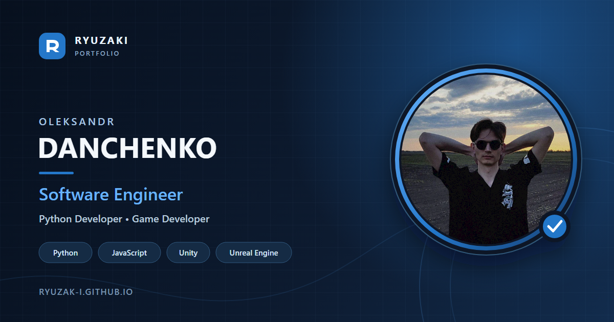

<p align="center">
  
</p>

<p align="center">
  <a href="README.md">English</a> · <strong>Українська</strong>
</p>

# Особисте портфоліо

Адаптивне двомовне портфоліо та онлайн-резюме, створене без фреймворків і етапу збирання. Основна увага приділена зрозумілому представленню інформації, легким ресурсам, доступним інтерактивним елементам і власній системі локалізації на основі XML.

## Основні особливості

- Англійський та український інтерфейси з автоматичним визначенням мови браузера.
- XML-файли перекладів, англійська резервна локалізація та кешування в пам’яті.
- Адаптивне компонування для комп’ютерів, планшетів і телефонів.
- Семантичний HTML, керування з клавіатури та підтримка зменшення руху.
- Локальні SVG-набори іконок та оптимізовані WebP-зображення.
- Метадані Open Graph і Twitter Card із власним соціальним прев’ю.
- Вимкнена пошукова індексація: опубліковане портфоліо розраховане на відкриття за прямим посиланням.

## Технічний огляд

### Локалізація на основі XML

Доступні мови та шляхи до перекладів оголошені в `config.json`. Під час запуску `localization.js` читає мовні налаштування браузера, завантажує необхідні XML-файли, об’єднує вибрану мову з англійською резервною локалізацією та оновлює видимий вміст і локалізовані метадані.

```text
config.json
    ↓
navigator.languages → вибір мови
    ↓
англійський XML + XML вибраної мови
    ↓
вміст сторінки, заголовок і соціальні метадані
```

Отримані переклади кешуються в пам’яті, тому перемикання мови не спричиняє повторного завантаження того самого XML-документа.

### Інтерфейс та анімації

Сторінка використовує CSS-переходи та систему появи елементів на основі `IntersectionObserver`. Анімації залишаються декоративними, а медіазапит `prefers-reduced-motion` вимикає необов’язкові ефекти для відвідувачів, які віддають перевагу мінімальному руху.

### Ресурси та швидкодія

Проєкт використовує локальні SVG-іконки замість зовнішнього іконкового шрифту. Фотографії та зображення проєктів збережені у WebP, мають явні розміри й за потреби використовують адаптивне або відкладене завантаження. Картка для поширення залишається у PNG для кращої сумісності із сервісами прев’ю посилань.

### Поширення без пошукової індексації

Теги Open Graph і Twitter Card забезпечують узгоджене прев’ю під час поширення прямого посилання. Водночас сторінка використовує `noindex, nofollow` і не публікує sitemap. Це забороняє сумлінним пошуковим системам додавати портфоліо до результатів, але не є контролем доступу чи захистом паролем.

## Технології

| Напрям | Технології |
| --- | --- |
| Розмітка | HTML5, семантичні елементи, SVG-спрайти |
| Стилі | CSS3, адаптивні медіазапити, власні анімації |
| Логіка | Vanilla JavaScript, Fetch API, DOMParser, IntersectionObserver |
| Локалізація | XML, визначення мови браузера |
| Медіа | WebP, PNG, SVG, OGG |
| Хостинг | GitHub Pages |

## Структура проєкту

```text
.
├── index.html                 # Розмітка та статичні соціальні метадані
├── style.css                 # Компонування, теми, адаптивність та анімації
├── config.json               # Налаштування локалізації
└── res
    ├── audio                  # Необов’язковий фоновий звук
    ├── icons                  # SVG-іконки сайту, прапорів і технологій
    ├── img                    # Оптимізовані зображення та соціальне прев’ю
    ├── scripts                # Локалізація, поява при прокрутці та керування звуком
    └── locales
        ├── en/translations.xml # Англійський вміст
        └── uk/translations.xml # Український вміст
```

## Локальний запуск

Сторінка завантажує конфігурацію та переклади через `fetch`, тому її потрібно відкривати через локальний HTTP-сервер, а не безпосередньо через `file://`.

За допомогою Python у Windows:

```powershell
py -m http.server 8000
```

Після цього відкрийте `http://localhost:8000/`. Як альтернативу можна використати розширення VS Code Live Server.

## Оновлення портфоліо

- Редагуйте видимі тексти в `res/locales/en/translations.xml` і `res/locales/uk/translations.xml`.
- Додавайте або видаляйте підтримувані мови в `config.json`.
- Змінюйте компонування та візуальну поведінку у `style.css`.
- Оновлюйте спільні іконки сайту в `res/icons/site-icons.svg`.
- Редагуйте `res/img/seo/portfolio-preview.svg` і повторно створюйте PNG після зміни соціальної картки.

## Авторські права та сторонні ресурси

Copyright © 2026 Oleksandr Danchenko. Усі права захищено.

Сторонні іконки та інші ресурси використовуються відповідно до ліцензій, розміщених поруч із відповідними файлами.
